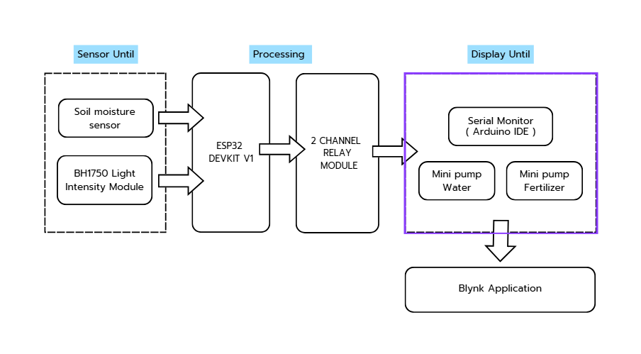

# Veg-x-bio Project

Veg(x)bio เป็นระบบช่วยดูแลต้นไม้และพืชผักอัตโนมัติ เหมาะสำหรับผู้ที่รักการปลูกแต่มีเวลาจำกัด  

## ฟีเจอร์หลัก
- ให้น้ำและใส่ปุ๋ยอัตโนมัติ
- ตรวจวัดความชื้นในดินและระดับแสงที่พืชได้รับ
- แสดงสถานะเรียลไทม์บนหน้าจอ
- แจ้งเตือนผ่านแอปเมื่อความชื้นหรือแสงไม่เหมาะสม
- ตั้งค่าชนิดของพืชเพื่อปรับการดูแลอย่างเหมาะสม

## เทคโนโลยีที่ใช้
- ESP32 DevKit V1
- เซ็นเซอร์วัดความชื้นในดิน
- เซ็นเซอร์วัดความเข้มแสง BH1750
- Mini Pump สำหรับน้ำและปุ๋ย
- 2 Channel Relay Module
- แอปพลิเคชัน Blynk สำหรับการติดต่อทางไกล

